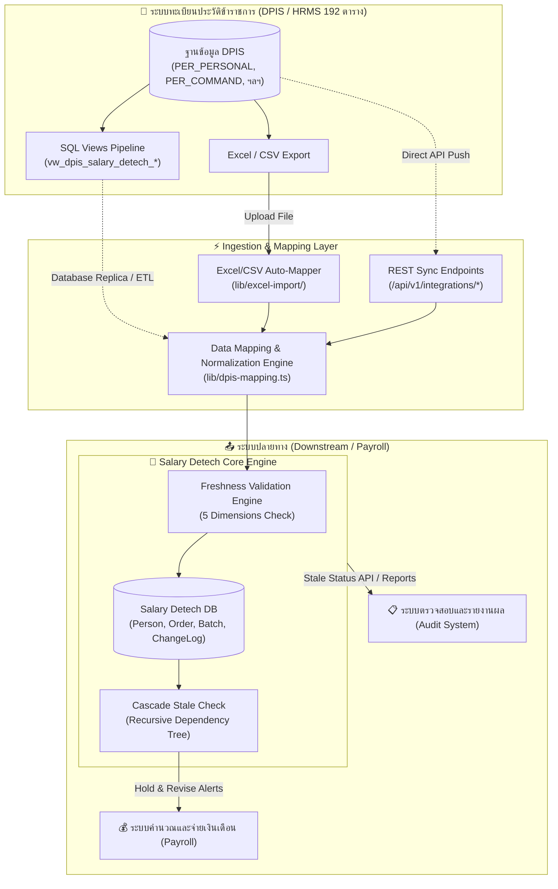

# สถาปัตยกรรม Data Pipeline และการเชื่อมต่อระบบภายนอก (Data Integration Architecture)

> เอกสารคู่มือการเชื่อมโยงระบบฐานข้อมูลข้าราชการมาตรฐาน (DPIS 192 ตาราง) เข้ากับระบบตรวจสอบความสดใหม่ (Salary Detech)

---

## 1. ภาพรวมสถาปัตยกรรม (System Architecture Overview)

ระบบ **Salary Detech** ทำหน้าที่เป็น **Smart Freshness & Integrity Engine** ที่สามารถเชื่อมต่อกับระบบบริหารทรัพยากรบุคคลภาครัฐ (DPIS/HRMS) และระบบจ่ายเงินเดือน (Payroll/ERP) ผ่าน 3 ช่องทางหลัก:



---

## 2. การเชื่อมต่อข้อมูลขาเข้า (Inbound Data Pipeline)

### ช่องทางที่ 1: การดึงผ่าน SQL Database Views (สำหรับ Database Replication / Direct ETL)
ไฟล์สคริปต์: [`scripts/dpis-integration-pipeline.sql`](file:///D:/00%20hrProject/salary-detech/scripts/dpis-integration-pipeline.sql)
สร้าง Views 3 ตัวบนฐานข้อมูล DPIS ต้นทาง:
1. `vw_dpis_salary_detech_person`: สกัดข้อมูลข้าราชการ ตำแหน่ง สังกัด และเงินเดือนปัจจุบัน
2. `vw_dpis_salary_detech_order`: สกัดข้อมูลคำสั่งและบัญชีแนบท้าย (ทั้ง Snapshot เดิมและใหม่)
3. `vw_dpis_salary_detech_salary_history`: สกัดประวัติการเลื่อนเงินเดือนย้อนหลัง

### ช่องทางที่ 2: REST API สำหรับการรับข้อมูลอัตโนมัติ (Automated API Ingestion)

> **สิ่งที่ต้องแนบทุกคำขอ:** Header `Authorization: Bearer <INTEGRATION_SECRET>` (ตั้งค่าใน env ของระบบ) — ถ้าไม่แนบหรือค่าไม่ถูกต้องจะได้รับ `401` และถ้าฝั่งเซิร์ฟเวอร์ยังไม่ได้ตั้ง `INTEGRATION_SECRET` จะปฏิเสธทุกคำขอด้วย `503` (fail-closed)

- **Sync ข้อมูลบุคคล:** `POST /api/v1/integrations/employees/sync`
  - รองรับการส่งข้อมูลข้าราชการทั้งแบบรายบุคคล หรือแบบ Array (สูงสุด 1,000 รายการต่อคำขอ)
  - ทำการ Upsert อัตโนมัติตามเลขประจำตัวประชาชน (`citizenId`)
  - ตรวจชนิดข้อมูลรายแถวด้วย Zod — แถวที่ผิดรูปแบบถูกรายงานเป็น error ของแถวนั้น ไม่กระทบทั้งชุด
- **Sync ข้อมูลคำสั่ง:** `POST /api/v1/integrations/orders/sync`
  - รับข้อมูลคำสั่งทางทะเบียนประวัติ (สูงสุด 1,000 รายการต่อคำขอ)
  - ทำการค้นหา `employeeId` จาก `citizenId` ให้อัตโนมัติ
  - เรียกใช้ `validateOrderFreshness` และ `cascadeStaleCheck` แบบ Realtime ทันทีที่บันทึก

### ช่องทางที่ 3: การนำเข้าผ่านไฟล์ Excel / CSV (Manual & Batch Upload)
- รองรับทั้งหัวคอลัมน์ภาษาไทยทางการ (เช่น "เลขประจำตัวประชาชน", "เงินเดือนที่แต่งตั้ง", "วันที่มีผล")
- รองรับชื่อคอลัมน์ฐานข้อมูล DPIS (เช่น `per_cardno`, `cmd_salary`, `cmd_date`, `mov_code`)

---

## 3. ตารางจับคู่ฟิลด์มาตรฐาน (Data Mapping Matrix)

| ข้อมูลใน DPIS (192 Tables) | ฟิลด์ใน Salary Detech ([`schema.prisma`](file:///D:/00%20hrProject/salary-detech/prisma/schema.prisma)) | คำอธิบายและความหมาย |
|---|---|---|
| `PER_PERSONAL.per_cardno` | `Person.citizenId` | เลขประจำตัวประชาชน 13 หลัก |
| `PER_PRENAME.pn_name` | `Person.nameTitle` | คำนำหน้าชื่อ (นาย/นาง/นางสาว/ยศ) |
| `PER_PERSONAL.per_name` | `Person.firstName` | ชื่อตัว |
| `PER_PERSONAL.per_surname` | `Person.lastName` | นามสกุล |
| `PER_POSITION.pos_no` | `Person.positionNo` / `Order.positionNo` | เลขที่ตำแหน่ง |
| `PER_LINE.pl_name` | `Order.positionName` | ชื่อตำแหน่งในสายงาน |
| `PER_TYPE.pt_name` | `Order.positionType` | ประเภทตำแหน่ง (วิชาการ/ทั่วไป/อำนวยการ/บริหาร) |
| `PER_LEVEL.level_no` | `Order.positionLevel` | ระดับตำแหน่ง (ปฏิบัติการ/ชำนาญการ/ชำนาญการพิเศษ ฯลฯ) |
| `PER_COMMAND.com_no` | `Order.orderNo` | เลขที่คำสั่ง |
| `PER_COMMAND.com_date` | `Order.issueDate` | วันที่ออกคำสั่ง |
| `PER_COMDTL.cmd_date` | `Order.effectiveDate` | วันที่คำสั่งมีผลบังคับใช้ |
| `PER_COMDTL.mov_code` | `Order.movementCode` & `Order.orderType` | รหัสประเภทการเคลื่อนไหว ➔ แปลงเป็นประเภทคำสั่ง |
| `PER_COMDTL.cmd_salary` | `Order.salary` | อัตราเงินเดือนใหม่ที่ได้รับตามคำสั่ง |
| `PER_COMDTL.cmd_old_salary` | `Order.priorSalary` | อัตราเงินเดือนเดิมก่อนคำสั่งมีผล |
| `PER_COMDTL.cmd_spsalary` | `Order.specialCompensation` | เงินตอบแทนพิเศษ |
| `PER_COMDTL.cmd_position` | `Order.priorPositionName` | ตำแหน่งเดิม (กรณีบรรจุ/ย้าย/เลื่อน) |
| `PER_COMDTL.cmd_level` | `Order.priorPositionLevel` | ระดับตำแหน่งเดิม |
| `PER_ORG (5 ระดับ)` | `bureau`, `division`, `subDivision`, `department`, `ministry` | โครงสร้างสังกัด 5 ระดับ |

---

## 4. การส่งออกและให้บริการข้อมูลภายนอก (Outbound Pipeline & Payroll Integration)

### API ตรวจสอบสถานะก่อนจ่ายเงินเดือน (Freshness Pre-check API)
- **Endpoint:** `POST /api/v1/integrations/freshness-check`
- **การทำงาน:** ระบบ Payroll ส่งรายการ `orderIds` หรือ `employeeIds` มาตรวจก่อนประมวลผลจ่ายเงินเดือน
- **Response Example:**
```json
{
  "success": true,
  "timestamp": "2026-08-16T23:20:00.000Z",
  "summary": {
    "totalEvaluated": 2,
    "cleanOrders": 1,
    "staleOrders": 1
  },
  "data": [
    {
      "orderId": 105,
      "orderNo": "125/2569",
      "orderType": "salary_increase",
      "effectiveDate": "2026-04-01",
      "employee": {
        "id": 1,
        "citizenId": "1100500123456",
        "name": "สมชาย รักชาติ"
      },
      "freshness": {
        "overallStatus": "stale",
        "statusSalary": "stale",
        "statusLevel": "latest",
        "statusPosition": "latest",
        "statusType": "latest",
        "statusOrg": "latest"
      },
      "payrollAction": "HOLD_AND_REVISE"
    }
  ]
}
```

---

## 5. มาตรการความปลอดภัยและการจัดการข้อผิดพลาด (Security & Resilience)
1. **Machine-to-Machine Auth Gate:** ทุก endpoint ของ `/api/v1/integrations/*` ตรวจ `Authorization: Bearer <INTEGRATION_SECRET>` ผ่าน `lib/integration-auth.ts` แบบ **fail-closed** — ถ้าไม่ได้ตั้ง `INTEGRATION_SECRET` ใน env จะปฏิเสธทุกคำขอ (`503`) ไม่ปล่อยผ่าน และเทียบรหัสแบบ timing-safe
2. **Input Validation & Limits:** ตรวจข้อมูลรายแถวด้วย Zod (`lib/validation/integration-schema.ts`) และจำกัดขนาด batch สูงสุด 1,000 รายการต่อคำขอ (`413` เมื่อเกิน)
3. **Transaction Isolation:** การ Ingest ข้อมูลแบบ Batch มีระบบ Error Collection รายบรรทัด ทำให้คำสั่งที่ถูกต้องสามารถบันทึกได้โดยไม่ถูกยกเลิกทั้งชุด (Partial Batch Ingestion with Detailed Error Reporting)
4. **No PII Leakage:** ไม่มีบันทึกข้อมูลส่วนบุคคลสำคัญลงใน System Log ทั่วไป
